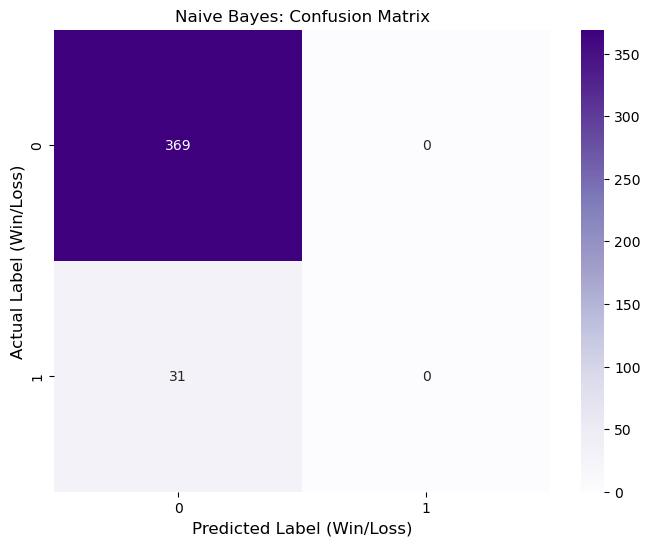

# 🔮 AI Oracle: Predictive Dice Destiny
**An End-to-End Machine Learning Web Application**

## 🚀 Live Demo
[View the Live App Here](https://ai-dice-oracle-predictive-risk-modeling-boas8cw6iztrpjrjej8jpe.streamlit.app/)

## 🚀 Overview
Most dice games are based on pure randomness. This project introduces a **Predictive Layer** using the **Gaussian Naive Bayes** algorithm to assess the probability of a "Win" state before the user rolls. It demonstrates the transition from data exploration in Jupyter to a production-ready Web App.

## 🛠️ Tech Stack
- **Language:** Python
- **ML Model:** Gaussian Naive Bayes (`scikit-learn`)
- **Deployment:** Streamlit Cloud
- **Data Tools:** Pandas, NumPy, Matplotlib, Seaborn

## 🧠 Machine Learning Concepts Applied
### 1. Naive Bayes Classification
Following my implementation on the Iris Dataset, I applied the same logic to a binary classification problem (Win/Loss). 
- **The "Naive" Assumption:** The model treats the 'Target Number' and 'User Luck' as independent features to calculate the posterior probability.

### 2. Model Evaluation
I used a **Confusion Matrix** to evaluate the model's performance on unseen data.

- **Precision & Recall:** Given that winning a dice roll is a "rare event" (e.g., rolling a 12 has a 2.7% chance), the model is optimized to avoid False Positives, ensuring realistic predictions.

## 🎮 How to Run Locally
1. Clone the repo: `git clone <your-link>`
2. Install requirements: `pip install -r requirements.txt`
3. Run the app: `streamlit run app.py`
